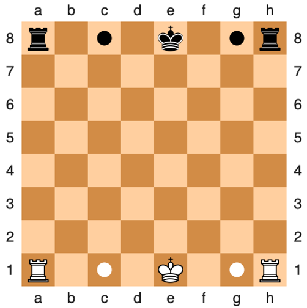

## AI_node.py
This node generates the chess move and publishing it in the ROS master. It first subscribes to the ROS topic that has the present chessboard information expressed in fen string and searches the best move for that present chessboard.

### Engine Download 

The chess engine, stockfish 11, is used for playing the game. The following steps are the procedure of downloading the engine from this branch.

* Open the folder ```Stockfish_11```
* Download and unzip the file: ```stockfish-11-linux```
* The chess engine is in folder ```Linux```, named: ```stockfish_20011801_x64```.

### Python-chess

The library, python-chess, is a package for communicating with the engine. The latest version is only for python3 so, when download via pip, make sure that pip downloads in correct python version.

* To download, run: ```pip install python-chess```

### Code explanation

Due to the python version requirement for using the python-chess package, the environment for running ROS node need to be python3, so the first line is ```#!/usr/bin/env python3```.
  
The information published by this node is a string. The picture below shows the chess board's fen string that the node received for searching a move and the published message.


In general, a message contains move(4 letters), castling(yes or no), capturing(yes or no). For example ```e2e4,no,no```.

* In move part string, the first two letters present which piece on that position is going to move. The last two letters present the position of the piece will arrive.

* Capturing is the action that piece takes down an opponent's piece.

* Castling is a tactic in chess. It can only be applied under the following condition, and it demonstrates by the picture below. When one of the rooks and king is at their original position i.e., king and rook, do not move after the game starts. Between them, there is no other piece. Then, the king can move to either g or c, and the rook on h will jump to f or rook on a will jump to d.


 
When a pawn reaches the other side of the chessboard edge, it gets the promotion, which this piece can be replaced by the other piece, for example, queen. It does not matter whether this piece is on the board or not. For this situation, the published message contains move(4 letters), castling(yes or no), capturing(yes or no), and piece type. For example, ```b7b8,no,no,q```, q stands for the queen.

